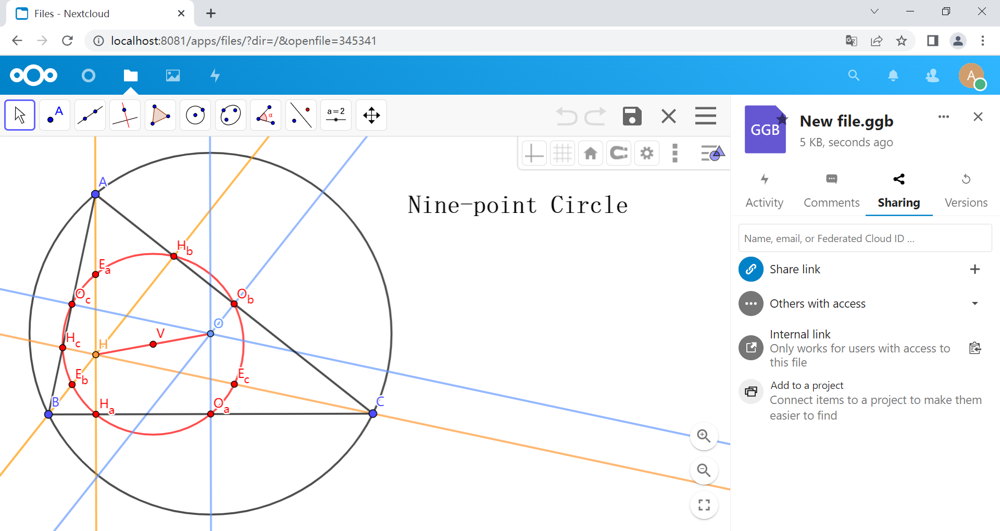
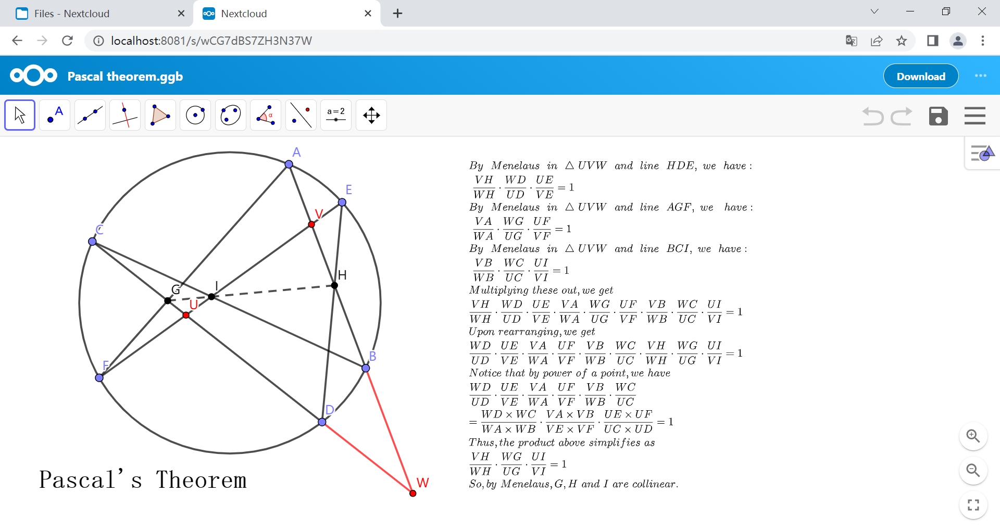
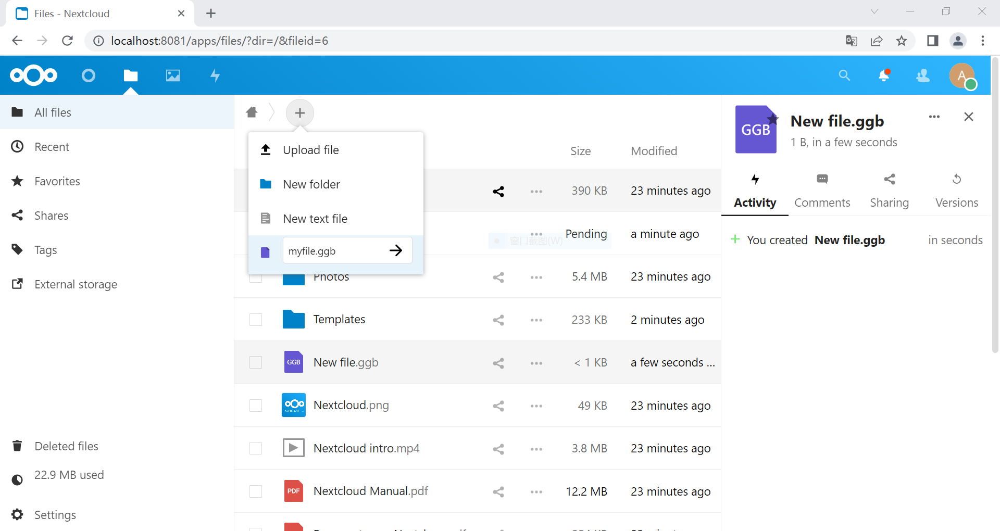

# geogebra-nextcloud

This app enables users to create, edit and share geogebra files in [Nextcloud](https://github.com/nextcloud) online.

## Preview

## How to install

*I only tested it on nextcloud-24.0.8 and it works.*

*maybe it can work on other versions, You can modify line 17 of `geogebra/appinfo/info.xml` to achieve it.*

**Step.1** clone the project

**Step.2** move folder `geogebra` to `{nextcloud_website_root_path}/apps/`

**Step.3** enable the app `Geogebra`

**Step.4** enjoy it

## Localization

Localization(L10N) is supported, you can make your own language translations and put it in the properly folder.

The translation of the Chinese Simplified has been completed. You can think of it as an example. (`zh_CN.js`, `zh_CN.json`)

## License

[GNU AGPL V3 license](https://www.gnu.org/licenses/agpl-3.0) © hvwyl