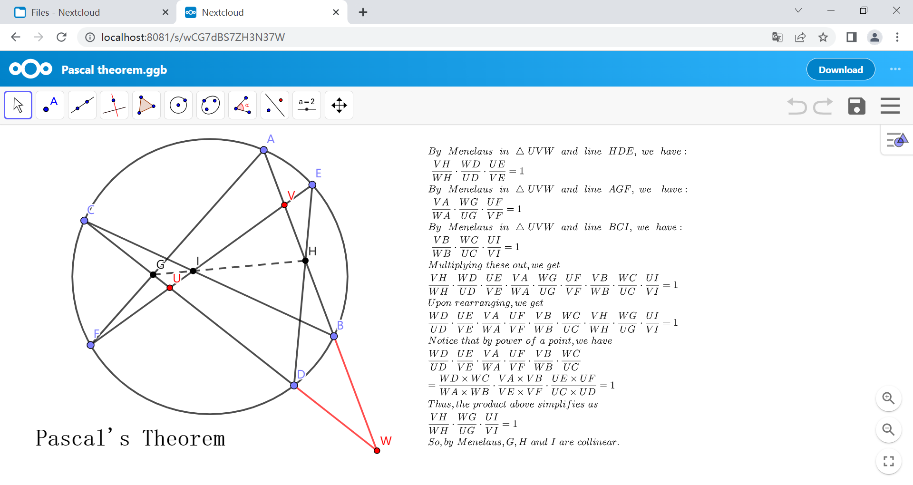

# geogebra-nextcloud

该应用允许用户在[Nextcloud](https://github.com/nextcloud)中在线创建、编辑和共享Geogebra文件。

## 预览

## 使用说明

*仅在nextcloud-24.0.8上进行过测试且可以正常工作。*

*或许在其他版本的Nextcloud上也可以正常工作，您可以修改文件`geogebra/appinfo/info.xml`的第七行来实现。*

**Step.1** 克隆该项目

**Step.2** 移动文件夹`geogebra`到`{nextcloud网站的根目录}/apps/`

**Step.3** 在应用中心Nextcloud启用应用`Geogebra`

**Step.4** 开始享用吧

## 本地化

支持Localization(L10N)，您可以创建自己的语言翻译文件把它放在对应的目录下。

简体中文（Chinese Simplified）的语言翻译文件已经完成了。您可以将他看作一个例子。(`zh_CN.js`, `zh_CN.json`)

## 使用许可

[GNU AGPL V3 license](https://www.gnu.org/licenses/agpl-3.0) © hvwyl